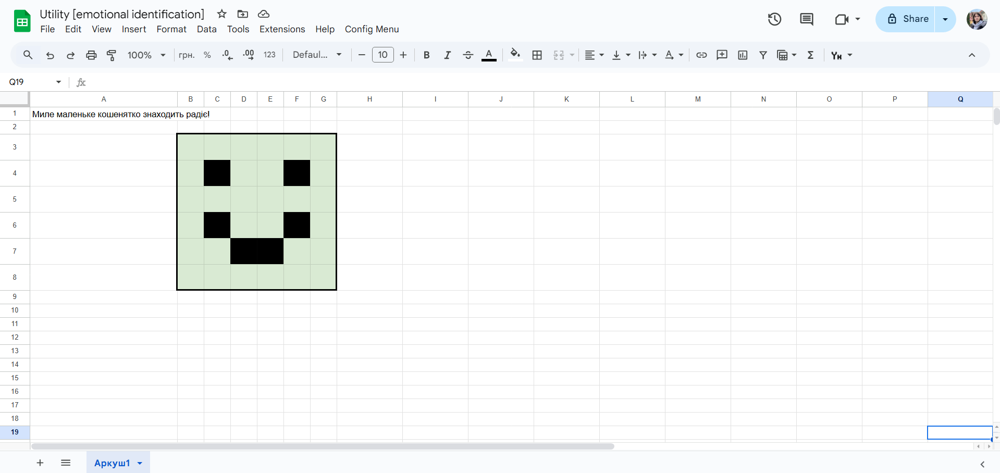
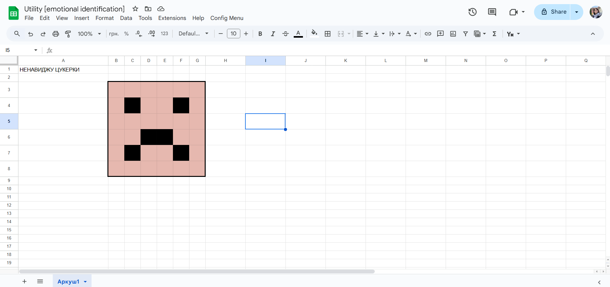

# Sentiment Analysis API

This repository provides a Flask-based API for performing sentiment analysis on user-provided text. It includes automatic text translation to English and sentiment scoring using the VADER sentiment analysis tool.

## Features

1. **Sentiment Analysis**:

   - Uses the VADER SentimentIntensityAnalyzer to analyze text for positive, neutral, and negative sentiment.

2. **Automatic Translation**:

   - Supports multiple languages by translating input text to English using Google Translate before analysis.

3. **REST API Endpoint**:

   - A single endpoint (`/sentiment`) for submitting text data and receiving sentiment scores in JSON format.

4. **Easy Deployment**:
   - Ready to run on local machines or deploy to cloud services like Heroku or AWS.

## Installation

1. Clone the repository:

   ```bash
   git clone https://github.com/your-username/your-repository.git
   cd your-repository
   ```

2. Install dependencies:

   ```bash
   pip install -r requirements.txt
   ```

3. Run the application:
   ```bash
   python main.py
   ```

## API Endpoint

### **POST** `/sentiment`

**Description**:
Analyze the sentiment of a provided sentence.

**Request Body**:

```json
{
  "sentence": "Your text here"
}
```

**Response**:

```json
{
  "sentiment": {
    "neg": 0.0,
    "neu": 0.8,
    "pos": 0.2,
    "compound": 0.5
  }
}
```

- `neg`, `neu`, `pos` represent the negative, neutral, and positive sentiment scores respectively.
- `compound` is the overall sentiment score, ranging from -1 (most negative) to 1 (most positive).

## How It Works

1. **Text Translation**:

   - The input text is translated to English using Google Translate (via the `translator.py` module).

2. **Sentiment Analysis**:

   - The translated text is analyzed using VADER, which provides sentiment scores for negative, neutral, positive, and compound sentiment.

3. **API Response**:
   - The sentiment scores are returned as a JSON response.

## Google Sheets Integration

For batch processing and analysis, you can integrate this utility with Google Sheets for example.





## License

This project is licensed under the MIT License. Feel free to use and modify it as needed.
